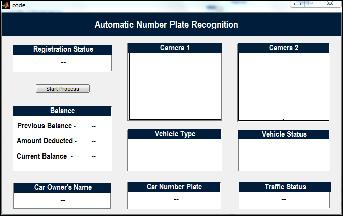
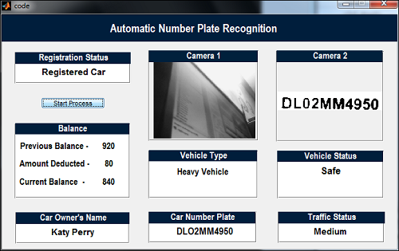
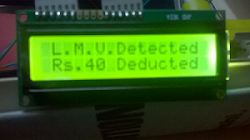
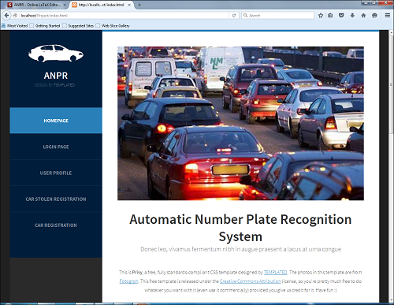
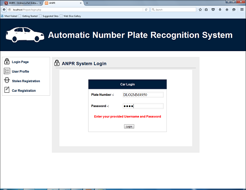
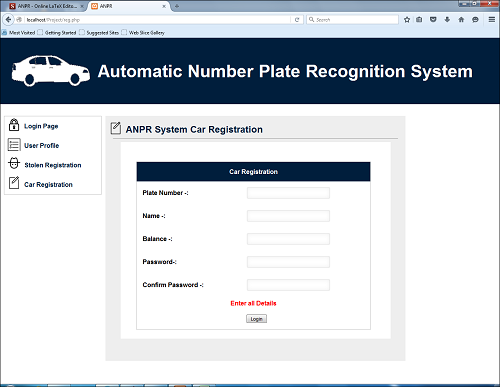
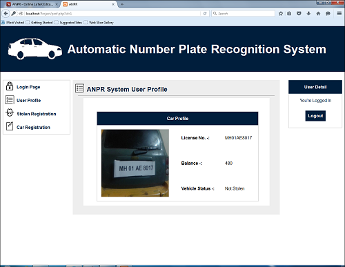
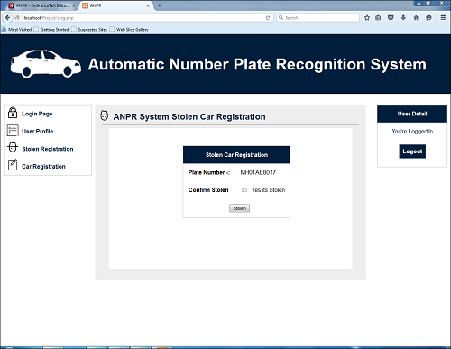

# Automatic Number Plate Recognition System (ANPR)

Automatic number plate recognition has became very important in our daily life because of the
unlimited increase of cars and transportation systems which make it impossible to be fully managed
and monitored by humans, examples are so many like traffc monitoring, tracking stolen cars, man-
aging parking toll, red-light violation enforcement, border and customs checkpoints. Yet its a very
challenging problem, due to the diversity of plate formats, different scales, rotations and non-uniform
illumination conditions during image acquisition. Automatic number plate recognition system is used
for the effective control of these vehicles.
ANPR is a software which captures the image of the vehicle at the toll booth, then extracts the number plate of the vehicle from the image and performs OCR to get the plate number for further transaction and manipulation. 

## Getting Started

* Open the code.m file in Project Folder.
* Set the path of the image in the code on which you want to perform processing.
* Run the code.m file and you will see the results.

### Prerequisites

* MATLAB

## Demo

### Main Software GUI

### Main Software Result

### Web Home Page

### Login Page

### Registration Page

### Profile Page

### Car Stolen Portal

Black Book Link : [https://github.com/mandar10/ANPR/blob/master/BlackBook.pdf](https://github.com/mandar10/ANPR/blob/master/BlackBook.pdf)

## Built With

* [MATLAB](https://www.mathworks.com/products/matlab.html)

## Authors

* **Mandar Mhapsekar**-[mandar10](https://github.com/mandar10)
* **Prathmesh Mhapsekar**-[prathmesh36](https://github.com/prathmesh36)
* **Omkar Dake**

## License

This project is licensed under the MIT License - see the [LICENSE.md](LICENSE.md) file for details
